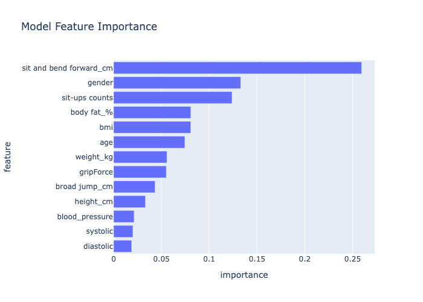
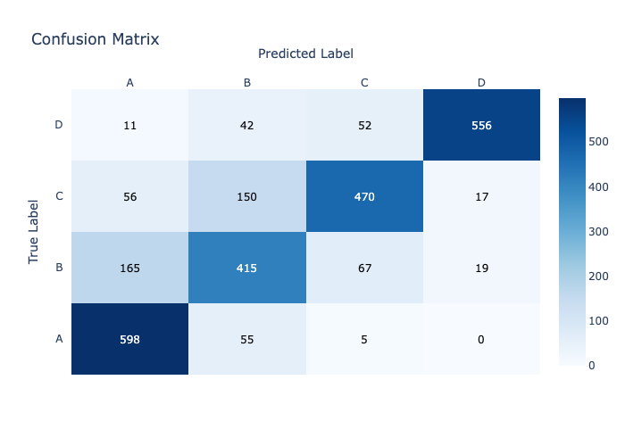
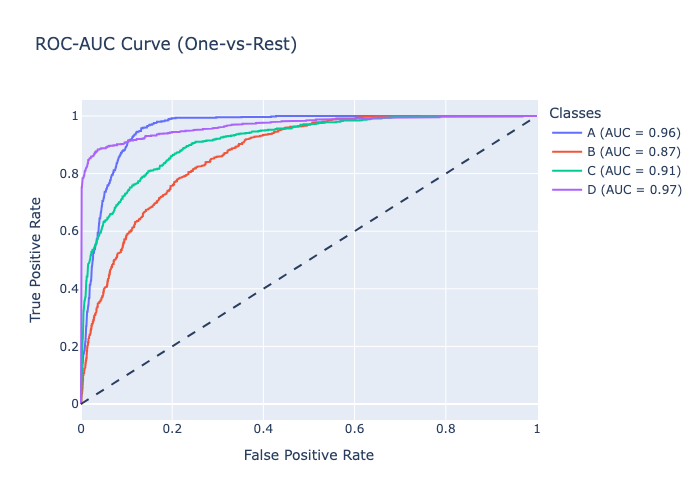

# Human Fitness Classification using Biometric and Strength Metrics

## Overview

This project aims to predict an individual’s fitness level (classified as A, B, or C) using biometric and strength-related measurements such as body fat percentage, blood pressure, grip strength, flexibility, and more.

The dataset represents over 13,000 individuals, containing various health indicators and performance metrics.
By leveraging machine learning and exploratory data analysis (EDA), this project identifies key factors that contribute to overall fitness and builds a predictive model to classify fitness levels.

## Problem Statement

How accurately can we predict a person’s fitness level based on measurable physiological and strength parameters?

**This problem is essential for**:

	- Designing personalized training programs
	- Monitoring health and performance progress
	- Supporting fitness apps or wellness platforms in automated recommendations

## Dataset Description

Source: healthyfime.csv\
Total records: 13,393\
Features: 12 columns

| **Feature** | **Description** |
|-------------|-------------|
| age | Age of individual |
| gender | Male/Female |
| height_cm | Height in centimeters |
| weight_kg | Weight in kilograms |
| body fat_% | Percentage of body fat |
| diastolic, systolic | Blood pressure readings |
| gripForce| Hand grip strength |
| sit and bend forward_cm | Flexibility test |
| sit-ups counts | Abdominal strength |
| broad jump_cm | Lower body power |
| class | Target variable – Fitness class (A, B, C) |

## Data Preprocessing

Steps taken to clean and prepare the data:

	1.	Handling invalid entries (e.g., 0 values in blood pressure or jump distance)
	2.	Encoding categorical variables (gender, class)
	3.	Feature Engineering:
		•	Body Mass Index (BMI) = weight_kg / (height_cm/100)^2
		•	Blood Pressure Ratio = systolic / diastolic
		•	Age group categorization
	4.	Normalization & Scaling: Applied for numerical features
	5.	Train-Test Split: 70/30 ratio

⸻

## Exploratory Data Analysis (EDA)

The EDA explored correlations, distributions, and feature relationships using:
	•	Correlation heatmaps
	•	Boxplots (fitness class vs body fat, gripForce, BMI)
	•	Scatter plots for strength vs flexibility
	•	Gender-based analysis of key indicators

Indepth analysis: Refer this: [ 🔍 View Insights Notebook](/notebooks/03_Insights_Report.md)

⸻

## Machine Learning Modeling

### Baseline Models
	•	Logistic Regression
	•	Random Forest Classifier
	•	XGBoost

### Evaluation Metrics
	•	Accuracy
	•	Precision, Recall, F1-Score
	•	ROC-AUC

## Results & Visuals
### Correlation Heatmap

  
   
  <em>Figure 1: Relationships among numerical.</em>

Displays 

### Feature Importance Chart

  
   
  <em>Figure 2: Feature importance highlighting key predictors of fitness levels.</em>

### Confusion Matrix

  
   
  <em>Figure 3:  Shows classification performance</em>

### AUC-ROC Curve

  
   
  <em>Figure 4: Model trade-offs between precision & recall</em>

## Future Work
	•	Including deep learning models for more complex pattern recognition
	•	SHAP Integration for explainable AI insights
	•	Collect more diverse data (e.g., lifestyle habits, diet patterns)

⸻

## Tech Stack
	•	Languages: Python
	•	Libraries: pandas, numpy, scikit-learn, xgboost
	•	Visualization: Plotly

