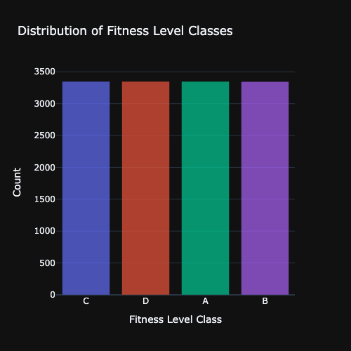
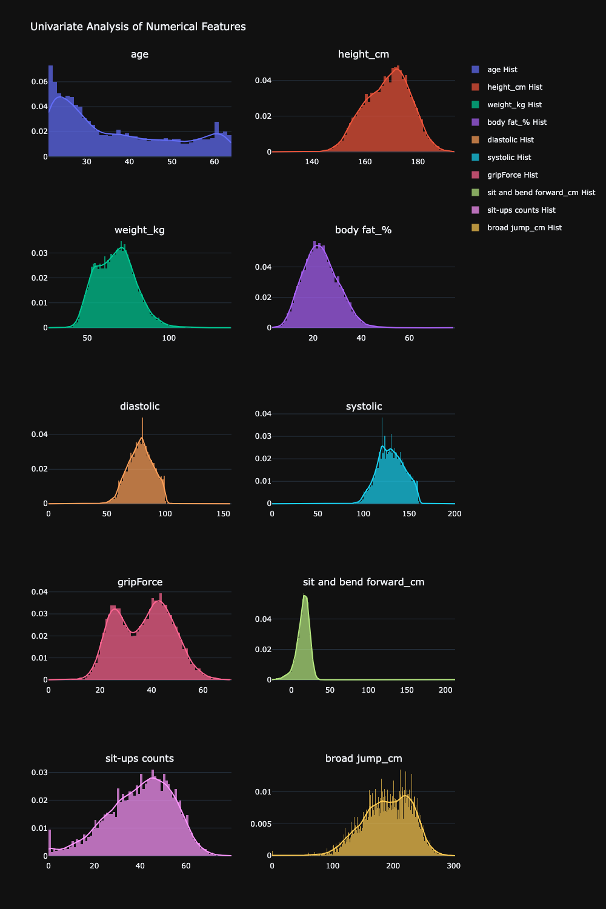
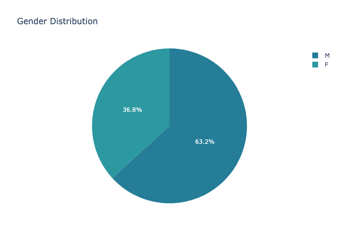
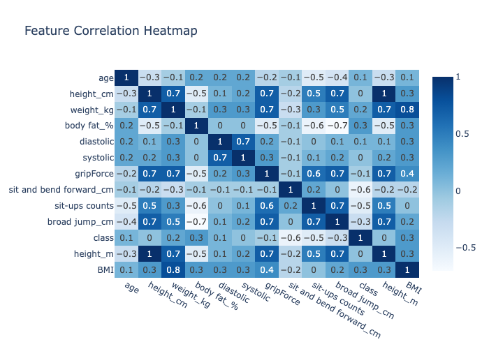
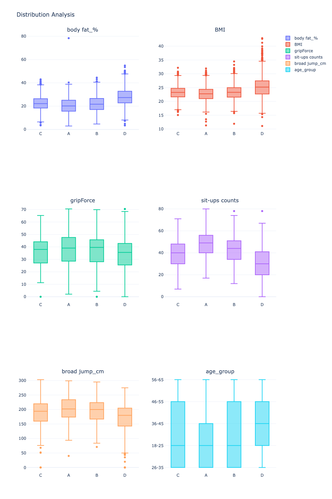

## 🧭 Exploratory Data Analysis – Insights Summary

### [Dataset Overview](#dataset-overview)
- **Entries:** 13,393  
- **Features:** 12 columns (10 numerical, 2 categorical)  
- **Missing Values:** None detected  
- **Target Variable:** `class` — balanced across all categories (A–D)  

---

### Statistical Highlights
- **Age:** 21–64 years (mean ≈ 36.8)  
- **Gender:** 63% male, 37% female  
- **Height / Weight:** Mean height ≈ 168.6 cm, mean weight ≈ 67.4 kg  
- **Body Fat %:** Average 23.2%, spanning from 3% to 78% → clear upper-end outliers  
- **Blood Pressure:**  
  - Mean systolic ≈ 130 mmHg, mean diastolic ≈ 79 mmHg  
  - **Invalid zeros** observed — biologically impossible, requires data cleaning  
- **Grip Force, Sit-ups, Broad Jump:** A few 0 values likely represent missing data  
- **Sit and Bend Forward:** Range −25 to 213 cm → strong outliers at both extremes  

| Feature | Mean | Min | Max | Notes |
|----------|------|-----|-----|-------|
| Age | 36.8 | 21 | 64 | Adult fitness range |
| Height (cm) | 168.6 | 125 | 193.8 | Typical adult height |
| Weight (kg) | 67.4 | 26.3 | 138.1 | Possible outliers at high end |
| Body Fat (%) | 23.2 | 3 | 78.4 | Outliers present |
| Diastolic (mmHg) | 78.8 | 0 | 156.2 | Zeros invalid |
| Systolic (mmHg) | 130.2 | 0 | 201 | Zeros invalid |
| Grip Force | 36.9 | 0 | 70.5 | Missing values encoded as zero |
| Sit & Bend Forward (cm) | 15.2 | -25 | 213 | Outliers both sides |
| Sit-ups | 39.7 | 0 | 80 | Possible missing entries |
| Broad Jump (cm) | 190.1 | 0 | 303 | Normal performance range |
---

### Data Quality Observations
- **Zeros in physiological measures** (`systolic`, `diastolic`, `gripForce`) should be replaced or removed.  
- **Outliers** (especially in flexibility and fat percentage) may distort models — consider winsorizing.  
- **Feature scaling** will be necessary before modeling due to wide numeric range.

---

### Visual Insights

####  Class Distribution  
All four classes (A–D) are equally represented → ✅ *No class imbalance.*

  
   
  <em>Figure 1: Class distribution showing uniform representation across categories.</em>

---

####  Numerical Feature Distributions  
- Most features are **normally distributed** or slightly **skewed**  
- **Flexibility** has extreme right-skew (213 cm outlier)

  
   
  <em>Figure 2: Distribution plots for numerical features showing skewness and outliers.</em>

---

####  Gender Distribution  
-  ~63% Male vs 👩 ~37% Female  
- Gender may affect metrics like grip force and jump distance  

  
   
  <em>Figure 3: Gender breakdown showing moderate male dominance in dataset.</em>

---

####  Correlation Heatmap  
-  **Strong positive:** `Height ↔ Weight`, `Systolic ↔ Diastolic`  
-  **Moderate positive:** `GripForce ↔ Broad Jump`, `Sit-ups ↔ Broad Jump`  
-  **Negative:** `Body fat_% ↔ Sit-ups / Broad Jump`

  
   
  <em>Figure 4: Correlation matrix showing strong physiological relationships among features.</em>

---

####  Feature Distributions by Class  
-  **Class A:** Strong, lean (high sit-ups, jump, grip force)  
-  **Class D:** Lower performance, higher body fat and BP  
-  Clear separability → good signal for predictive models  

  
   
  <em>Figure 5: Class-wise comparison — visible separability across fitness levels.</em>

---
---

### Summary
The dataset is rich, balanced, and mostly clean, but contains:
- Outliers in flexibility and fat percentage  
- Zero-value anomalies in physiological metrics  

Relationships among features align with real-world expectations. These patterns suggest strong potential for predictive modeling — especially for classifying fitness levels or health categories.

---

### Next Steps
- Replace invalid zero values and handle outliers  
- Encode categorical variables (`gender`, `class`)  
- Apply scaling or normalization  
- Use correlation results to reduce redundancy (PCA or feature selection)  
- Proceed with modeling and evaluation